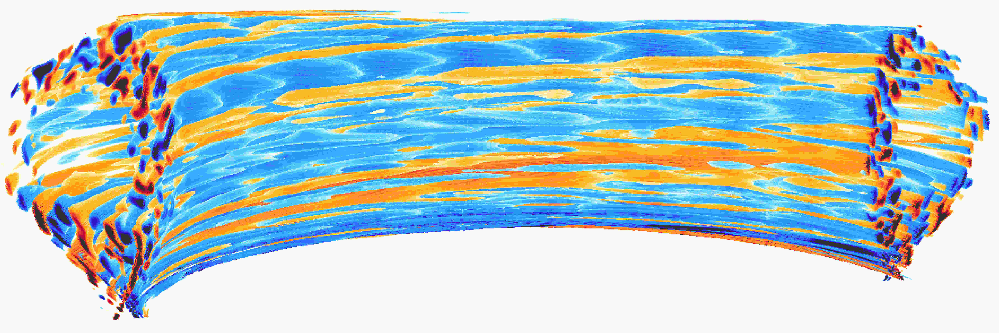

# Welcome to the FELTOR project!



FELTOR (Full-F ELectromagnetic code in TORoidal geometry) is both a numerical library and a scientific software package built on top of it.

Its main physical target are plasma edge and scrape-off layer (gyro-)fluid simulations.
The numerical methods centre around discontinuous Galerkin methods on structured grids. 
Our core level functions are parallelized for a variety of hardware from multi-core cpu to hybrid MPI+GPU, which makes the library incredibly fast. 

[](https://zenodo.org/badge/latestdoi/14143578)
[](LICENSE)

## 1. Quick start guide
Go ahead and clone our library into any folder you like 
```sh
$ git clone https://www.github.com/feltor-dev/feltor
```
You also need to clone  [thrust]( https://github.com/thrust/thrust) and [cusp](https://github.com/cusplibrary/cusplibrary) distributed under the Apache-2.0 license. So again in a folder of your choice
```sh
$ git clone https://www.github.com/thrust/thrust
$ git clone https://www.github.com/cusplibrary/cusplibrary
```
> Our code only depends on external libraries that are themselves openly available. We note here that we do not distribute copies of these libraries.

Now you need to tell the feltor configuration where these external libraries are located on your computer. The default way to do this is to go in your `HOME` directory, make an include directory and link the paths in this directory:
 ```sh
 $ cd ~
 $ mkdir include
 $ cd include
 $ ln -s path/to/thrust/thrust thrust
 $ ln -s path/to/cusplibrary/cusp cusp
```
> If you do not like this, you can also create your own config file as discribed [here](https://github.com/feltor-dev/feltor/wiki/Configuration).

Now let us compile the first benchmark program. 
 

 ```sh
 $ cd path/to/feltor/inc/dg
 
 $ make blas_b device=omp #(for an OpenMP version)
 #or
 $ make blas_b device=gpu #(if you have a gpu and nvcc )
 ```
> The minimum requirement to compile and run an application is a working C++ compiler (g++ per default) and a CPU. 
> To simplify the compilation process we use the GNU Make utility, a standard build automation tool that automatically builds the executable program. 
> We don't use new C++-11 standard features to avoid complications since some clusters are a bit behind on up-to-date compilers.
> The OpenMP standard is natively supported by most recent C++ compilers.   
> Our GPU backend uses the [Nvidia-CUDA](https://developer.nvidia.com/cuda-zone) programming environment and in order to compile and run a program for a GPU a user needs the nvcc CUDA compiler (available free of charge) and a NVidia GPU. However, we explicitly note here that due to the modular design of our software a user does not have to possess a GPU nor the nvcc compiler. The CPU version of the backend is equally valid and provides the same functionality.


Run the code with 
```sh
$ ./blas_b 
```
and when prompted for input vector sizes type for example
`3 100 100 10`
which makes a grid with 3 polynomial coefficients, 100 cells in x, 100 cells in y and 10 in z. If you compiled for OpenMP, you can set the number of threads with e.g. `export OMP_NUM_THREADS=4`.
> This is a benchmark program to benchmark various elemental functions the library is built on. Go ahead and vary the input parameters and
see how your hardware performs. You can compile and run any other program that ends in `_t.cu` (test programs) or `_b.cu` (benchmark programs) in `feltor/inc/dg` in this way. 

Now, let us test the mpi setup 
> You can of course skip this if you don't have mpi installed on your computer.
> If you intend to use the MPI backend, an implementation library of the mpi standard is required. Per default `mpic++` is used for compilation.

```sh
 $ cd path/to/feltor/inc/dg
 
 $ make blas_mpib device=omp  # (for MPI+OpenMP)
 # or
 $ make blas_mpib device=gpu # (for MPI+GPU)
 ```
Run the code with
`$ mpirun -n '# of procs' ./blas_mpib `
then tell how many process you want to use in the x-, y- and z- direction, for example:
`2 2 1` (i.e. 2 procs in x, 2 procs in y and 1 in z; total number of procs is 4)
when prompted for input vector sizes type for example
`3 100 100 10` (number of cells divided by number of procs must be an integer number). If you compiled for MPI+OpenMP, you can set the number of OpenMP threads with e.g. `export OMP_NUM_THREADS=2`.

Now, we want to compile a simulation program. First, we have to download and install some libraries for I/O-operations.

For data output we use the [NetCDF](http://www.unidata.ucar.edu/software/netcdf/) library under an MIT - like license. The underlying [HDF5](https://www.hdfgroup.org/HDF5/) library also uses a very permissive license. Note that for the mpi versions of applications you need to build hdf5 and netcdf with the --enable-parallel flag. Do NOT use the pnetcdf library, which uses the classic netcdf file format.  
Our JSON input files are parsed by [JsonCpp](https://www.github.com/open-source-parsers/jsoncpp) distributed under the MIT license (the 0.y.x branch to avoid C++-11 support).     
> Some desktop applications in FELTOR use the [draw library]( https://github.com/mwiesenberger/draw) (developed by us also under MIT), which depends on OpenGL (s.a. [installation guide](http://en.wikibooks.org/wiki/OpenGL_Programming)) and [glfw](http://www.glfw.org), an OpenGL development library under a BSD-like license. You don't need these when you are on a cluster. 

 
As in Step 3 you need to create links to the jsoncpp library include path (and optionally the draw library) in your include folder or provide the paths in your config file. We are ready to compile now

```sh
 $ cd path/to/feltor/src/toefl # or any other project in the src folder
 
 $ make toeflR device=gpu     # (compile on gpu or omp)
 $ ./toeflR <inputfile.json>  # (behold a live simulation with glfw output on screen)
 # or
 $ make toefl_hpc device=gpu  # (compile on gpu or omp)
 $ ./toefl_hpc <inputfile.json> <outputfile.nc> # (a single node simulation with output stored in a file)
 # or
 $ make toefl_mpi device=omp  # (compile on gpu or omp)
 $ export OMP_NUM_THREADS=2   # (set OpenMP thread number to 1 for pure MPI) 
 $ echo 2 2 | mpirun -n 4 ./toefl_mpi <inputfile.json> <outputfile.json>
 $ # (a multi node simulation with now in total 8 threads with output stored in a file)
 $ # The mpi program will wait for you to type the number of processes in x and y direction before
 $ # running. That is why the echo is there. 
```
A default input file is located in `path/to/feltor/src/toefl/input`. All three programs solve the same equations. 
The technical documentation on what equations are discretized, 
input/output parameters, etc. can be generated as a pdf with 
`make doc ` in the `path/to/feltor/src/toefl` directory.

## 2. Further reading
Please check out our [wiki pages](https://github.com/feltor-dev/feltor/wiki) for some general information, user oriented documentation and Troubleshooting. 
Moreover, we maintain tex files in every src folder for technical documentation, 
 which can be compiled using pdflatex with 
`make doc ` in the respective src folder.
The [developer oriented documentation](http://feltor-dev.github.io/feltor/inc/dg/html/modules.html) of the dG library was generated with [Doxygen](http://www.doxygen.org). 
You can generate a local version from source code.
This depends on the `doxygen`, `libjs-mathjax` and `graphviz` packages.
Type `make doc` in the folder `path/to/feltor/inc/doc` and open `index.html` (a symbolic link to `dg/html/modules.html`) with your favorite browser. 

## 3. Contributions and Acknowledgements
For instructions on how to contribute read the [wiki page](https://github.com/feltor-dev/feltor/wiki/Contributions).
We gratefully acknowledge contributions from 
- Ralph Kube
- Eduard Reiter
- Lukas Einkemmer
- Jakob Gath

We further acknowledge support on the Knights landing architecture from the High Level Support Team from 
- Albert Gutiérrez
- Xavier Saez

and from Intel Barcelona
- Harald Servat
## 4. License 
FELTOR is free software and licensed under the very permissive MIT license. It was originally developed by Matthias Wiesenberger and Markus Held.

## Official releases 
Our latest code release has a shiny DOI badge from zenodo

[](https://zenodo.org/badge/latestdoi/14143578)

which makes us officially citable.
